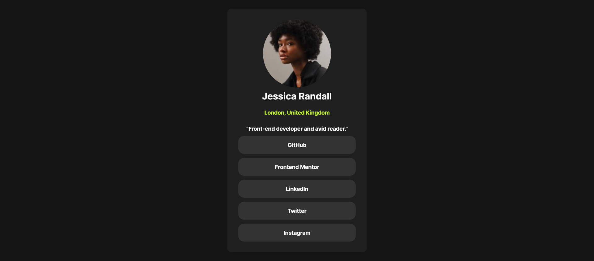

# Frontend Mentor - Social links profile solution

This is a solution to the [Social links profile challenge on Frontend Mentor](https://www.frontendmentor.io/challenges/social-links-profile-UG32l9m6dQ). Frontend Mentor challenges help you improve your coding skills by building realistic projects. 

## Table of contents

- [Overview](#overview)
  - [The challenge](#the-challenge)
  - [Screenshot](#screenshot)
  - [Links](#links)
- [My process](#my-process)
  - [Built with](#built-with)
  - [What I learned](#what-i-learned)
- [Author](#author)
- [Acknowledgments](#acknowledgments)

## Overview

In this small project, you'll build out your social link-sharing profile. You can even personalize it and use it to share all your social profiles!

### The challenge

Users should be able to:

- See hover and focus states for all interactive elements on the page

### Screenshot

### Links

- Solution URL: [Github](https://github.com/craigdev937/front_social_links_profile)
- Live Site URL: [Github Pages](https://craigdev937.github.io/front_social_links_profile/)

### Built with

- Semantic HTML5 markup
- CSS custom properties
- Flexbox
- CSS Grid
- Mobile-first workflow

### What I learned

I love to use CSS Flexbox and Grid.  I learned how to center the text and create links to other websites.

## Author

- Frontend Mentor - [@Craig Johnson](https://www.frontendmentor.io/profile/craigdev937)
- Twitter - [@craigdev937](https://twitter.com/Craigdev937)

